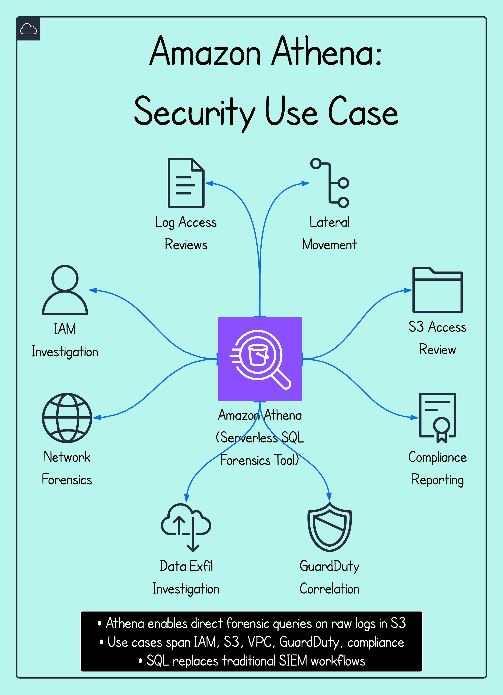

# Amazon Athena – Security Diagrams

This diagram series illustrates how Amazon Athena plays a critical role in cloud security investigations and log analysis. As a serverless query engine, Athena allows security teams to run fast, ad hoc SQL queries directly against raw data in Amazon S3, without needing to provision infrastructure, set up ingestion pipelines, or maintain a traditional SIEM.

Each diagram maps a common security workflow — from log parsing and alert triage to architectural insights and use case scenarios.

---

## Diagram 1.1 – Query Request

A security analyst initiates an investigation by writing a SQL query to identify suspicious activity — for example, `SELECT * FROM cloudtrail_logs WHERE eventName = 'GetObject' AND userIdentity.userName = 'IAMUser-X'`.

This allows targeted analysis of specific event types, users, IPs, or services without waiting for centralized log indexing or dashboards.

---

## Diagram 1.2 – Raw Log Scanning

Athena processes the SQL query by scanning the raw logs stored in Amazon S3. The logs may include:

- AWS CloudTrail (for API activity),
- VPC Flow Logs (for network traffic), and
- GuardDuty findings (for threat alerts).

If partitions are configured (e.g., by region, eventName, date), Athena scans only the relevant subset of files, dramatically improving performance and reducing cost.

---

## Diagram 1.3 – Query Results

Within seconds, Athena returns structured results in CSV or JSON — often displaying:

- A timeline of suspicious activity
- Associated IP addresses and geolocations
- Resource ARNs involved
- Identity context (IAM roles/users)

This enables rapid filtering, pivoting, and decision-making — especially helpful when correlating multiple log sources to validate or escalate incidents.

---

## Diagram 2 – Investigating an Alert

This diagram shows a full incident response (IR) flow:

- A GuardDuty finding triggers an alert (e.g., `Recon:EC2/PortProbeUnprotectedPort`)
- The analyst constructs a tailored SQL query in Athena
- The relevant S3-stored logs are scanned
- Results are returned with actionable metadata

This flexible, modular workflow can be reused across incident types — whether you're investigating policy changes, privilege escalations, or exfiltration attempts.

---

## Diagram 3 – How Athena Works

This architectural view breaks down Athena's internal components:

- **Raw Logs in S3:** CloudTrail, VPC Flow Logs, etc.
- **External Table Definitions (DDL):** Metadata stored in AWS Glue or directly registered via SQL
- **Query Execution Layer:** Athena uses Presto (Trino) under the hood to distribute query logic
- **Result Storage:** Query outputs are saved to a results S3 bucket, enabling repeatability, auditability, or downstream use (e.g., dashboards)

IAM permissions must allow Athena to read from source and write to the destination — which is a key part of securing its usage.

---

## Diagram 4 – Security Use Cases

Amazon Athena supports a wide variety of cloud-native security operations, including:

- **IAM Review:** List who accessed sensitive resources  
- **Network Analysis:** Trace egress/ingress traffic from VPC Flow Logs  
- **Threat Hunting:** Match patterns against known indicators (IPs, UserAgents, etc.)  
- **Lateral Movement Detection:** Identify suspicious sequences of API calls  
- **Compliance Auditing:** Generate custom reports for PCI-DSS, HIPAA, or CIS benchmarks  

All of this is done using SQL over raw logs, which makes Athena an incredibly versatile tool for teams that want speed, scale, and flexibility.

---

## Summary

Amazon Athena is a powerful, serverless log analysis engine that enables security teams to perform rapid forensics across AWS environments without needing to set up a full SIEM or ETL pipeline. These diagrams demonstrate how real-world analysts use Athena to triage alerts, investigate incidents, and perform audits using the data already sitting in S3.

Whether you're responding to GuardDuty alerts, reviewing IAM access, or chasing down a suspicious `PutObject` event, Athena gives you the ability to search, slice, and visualize log data using nothing but SQL.
